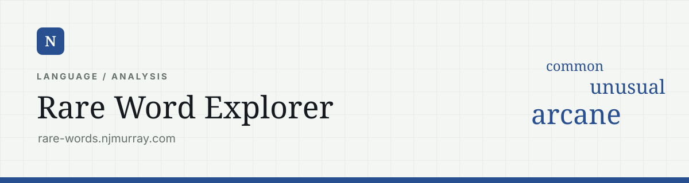
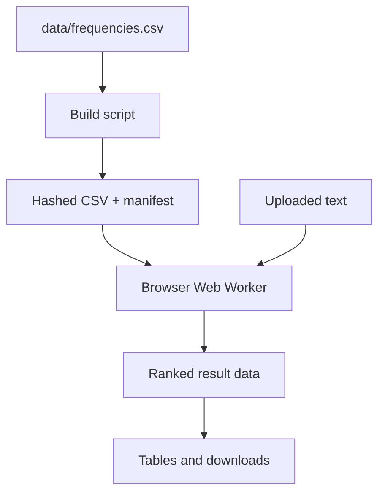

# Rare Word Explorer

Browser-based text analyser at `rare-words.njmurray.com`. It ranks words from an uploaded `.txt` file against a precomputed frequency corpus and exposes the least frequent matches.

The uploaded text never leaves the browser. Cloudflare serves the interface and the frequency dataset; all tokenisation, counting, sorting, context extraction, filtering, and export work happens locally.

## Architecture



There are three distinct stages:

1. **Build time:** prepare a cache-safe frequency asset and manifest.
2. **Page load:** stream the frequency asset into an in-memory lookup map.
3. **Analysis time:** process the selected text in a Web Worker and return structured results to the UI.

## Frequency-data build

`data/frequencies.csv` is the canonical source and is expected to use:

```csv
word,frequency
example,12345
```

`scripts/build.mjs`:

1. reads the complete source CSV;
2. computes a SHA-256 hash and keeps the first 12 hexadecimal characters;
3. removes previously generated `frequencies-<hash>.csv` files and the old manifest;
4. copies the source to `public/data/frequencies-<hash>.csv`;
5. writes `public/data/manifest.json` containing the filename, row count, byte count, hash, and generation time.

Example manifest:

```json
{
  "file": "frequencies-a1b2c3d4e5f6.csv",
  "rows": 400000,
  "bytes": 6500000,
  "hash": "a1b2c3d4e5f6",
  "generatedAt": "2026-05-07T12:00:00.000Z"
}
```

The content hash solves cache invalidation. A changed corpus creates a new URL, so the CSV can be cached for a year as immutable. The much smaller manifest is cached for five minutes and points each page load to the current data file.

## Page-load sequence

`public/app.js` creates a module Web Worker from `public/frequency-worker.js` and immediately sends:

```js
{ type: "load-frequency" }
```

The worker keeps three module-level values:

- `frequencyMap`: the completed `Map<word, frequency>`;
- `frequencyMeta`: the parsed manifest;
- `loadingPromise`: a shared in-progress load, preventing duplicate fetches.

The worker fetches `data/manifest.json` with `force-cache`, resolves the hashed CSV relative to the manifest URL, and then loads the frequency data.

When `ReadableStream` and `TextDecoderStream` are available, the CSV is decoded incrementally. A carry string preserves an incomplete final line between chunks. Each complete line is parsed immediately and progress is posted back to the page. Older browsers fall back to reading the full response as text.

The parser:

- ignores an optional byte-order mark;
- skips the `word,frequency` header;
- splits on the first comma;
- lowercases the word;
- accepts the row only when the frequency parses as a finite number.

Once complete, the worker sends `frequency-ready`. The page marks the progress bar as ready and automatically analyses a file if one was selected while the corpus was still loading.

## Analysis lifecycle

### File handling

The page supports the file input and drag-and-drop. `File.text()` reads the selected file into `state.fileText`; no upload request is made.

The main-thread state is:

```js
{
  fileText: "",
  fileName: "",
  fileBytes: 0,
  frequencyReady: false,
  currentJob: 0,
  results: null
}
```

Every analysis increments `currentJob`. The job ID is included in the worker message, and the page accepts a result only when its ID still matches the latest job. Rapid settings changes can therefore produce overlapping worker messages without allowing a stale result to replace the newest one.

### Tokenisation and counting

The worker lowercases the complete text and extracts tokens with:

```js
/[a-z]+/g
```

It then builds `Map<word, count>`. This is a unique-word map, so each word is looked up in the frequency corpus once regardless of how often it appears in the text.

The unique words are split into:

- `matchedRows`: words present in the frequency corpus;
- `unmatchedRows`: words absent from the corpus.

### Ranking

Matched rows are sorted by:

1. ascending corpus frequency — rarer words first;
2. descending count in the uploaded text;
3. alphabetical word order.

Only the first `topN` matched rows become `rareRows`.

Unmatched rows are sorted by:

1. descending count in the uploaded text;
2. alphabetical word order.

When unmatched display is enabled, at most 2,000 unmatched rows are returned to the page. The statistics still count all unmatched unique words, including those beyond the display cap.

### Context extraction

Context is calculated only when requested because it is more expensive than frequency lookup.

The text is divided into sentences with `Intl.Segmenter("en", { granularity: "sentence" })` where available, otherwise with a punctuation-and-whitespace regular expression. For each requested word, the worker finds the first sentence containing that word on ASCII-letter boundaries and joins:

- the preceding sentence, when present;
- the matching sentence;
- the following sentence, when present.

The first match wins. Later appearances are not included.

### Returned result

```js
{
  rareRows: [{ word, count, frequency, context? }],
  unmatchedRows: [{ word, count, context? }],
  stats: {
    totalTokens,
    uniqueWords,
    matchedWords,
    unmatchedWords,
    elapsedMs
  }
}
```

`matchedWords` and `unmatchedWords` are counts of unique words, while `totalTokens` counts every occurrence.

## Main-thread rendering

`public/app.js` derives table columns from the active settings:

- count is optional for rare-word results;
- context is optional for both result tables;
- unmatched words are placed in a separate panel.

The search box filters the already-ranked rare-word rows by substring. It does not rerun the worker and does not search the unmatched table.

Tables are constructed with DOM nodes and `textContent`, avoiding HTML interpolation of uploaded text. The UI also tracks:

- loading and analysis states;
- source filename and byte size;
- analysis duration;
- matched/unmatched summary counts;
- whether each export button should be enabled.

## Downloads

The rare-word export uses the currently selected visible columns and exports all `rareRows`, not only rows remaining after the on-page text filter.

CSV values containing commas, quotes, or line breaks are quoted and internal quotes are doubled. Unmatched words are exported as one word per line in a text file.

Both files are produced with an in-memory `Blob` and temporary object URL. The source filename is normalised into a lowercase, hyphenated filename:

```text
Novel Draft.txt
→ novel-draft-rare-words.csv
→ novel-draft-missing-words.txt
```

## Worker and asset routing

`src/worker.js` is intentionally thin:

- `/` is rewritten to `/index.html`;
- normal asset paths are served through the `ASSETS` binding;
- an extensionless missing path falls back to `/index.html`;
- missing paths with a file extension remain `404`.

This gives the static app SPA-style route fallback without moving any analysis to the server.

`public/_headers` defines the browser-facing cache strategy:

| Asset | Cache policy |
| --- | --- |
| Hashed frequency CSV | One year, immutable |
| Frequency manifest | Five minutes, must revalidate |
| JavaScript and CSS | One hour |

## Worker messages

| Message | Direction | Purpose |
| --- | --- | --- |
| `load-frequency` | Page → worker | Begin or reuse frequency-map loading. |
| `frequency-progress` | Worker → page | Update byte-based load progress. |
| `frequency-ready` | Worker → page | Confirm row count and readiness. |
| `frequency-error` | Worker → page | Surface manifest or CSV loading failure. |
| `analyze` | Page → worker | Send text, options, and job ID. |
| `analysis-result` | Worker → page | Return the structured result for a job. |
| `analysis-error` | Worker → page | Surface an analysis exception. |

## File map

| File | Responsibility |
| --- | --- |
| `data/frequencies.csv` | Canonical word-frequency corpus. |
| `scripts/build.mjs` | Hashing, generated-asset cleanup, CSV copy, and manifest generation. |
| `public/index.html` | Controls, status elements, result panels, and semantic page structure. |
| `public/styles.css` | Responsive layout, state styling, tables, drop target, and progress bar. |
| `public/app.js` | Main-thread state, file handling, worker messages, rendering, filtering, and downloads. |
| `public/frequency-worker.js` | CSV streaming, lookup-map construction, tokenisation, ranking, and context extraction. |
| `public/_headers` | Asset cache headers. |
| `src/worker.js` | Static asset routing and extensionless fallback. |
| `wrangler.toml` | Worker entry point, asset binding, and custom domain. |

## Change map

| Change | Main location |
| --- | --- |
| Reference corpus | `data/frequencies.csv` |
| Definition of a token | regex in `analyzeText()` |
| Ranking tie-breaks | `matchedRows.sort()` |
| Unmatched result cap | `visibleUnmatchedRows` |
| Context window | `addContexts()` |
| Default and allowed top-N values | controls in `public/index.html` |
| Result columns and exports | `resultColumns()`, `missingColumns()`, and download handlers |
| Cache lifetimes | `public/_headers` |
| Route fallback | `src/worker.js` |

## Interpretation and constraints

- “Rare” means low frequency in this specific corpus, not objectively rare in every form of English.
- An unmatched word is unknown, not necessarily rarer than every matched word.
- The tokeniser excludes digits, apostrophes, hyphens, accented characters, and non-Latin scripts.
- Contractions and hyphenated forms are split into multiple tokens.
- Proper names, inflections, OCR artefacts, and spelling errors are likely to appear as unmatched.
- The full text and frequency map must fit in browser memory.
- Context extraction returns only the first occurrence and can become expensive when enabled for many unmatched words.
